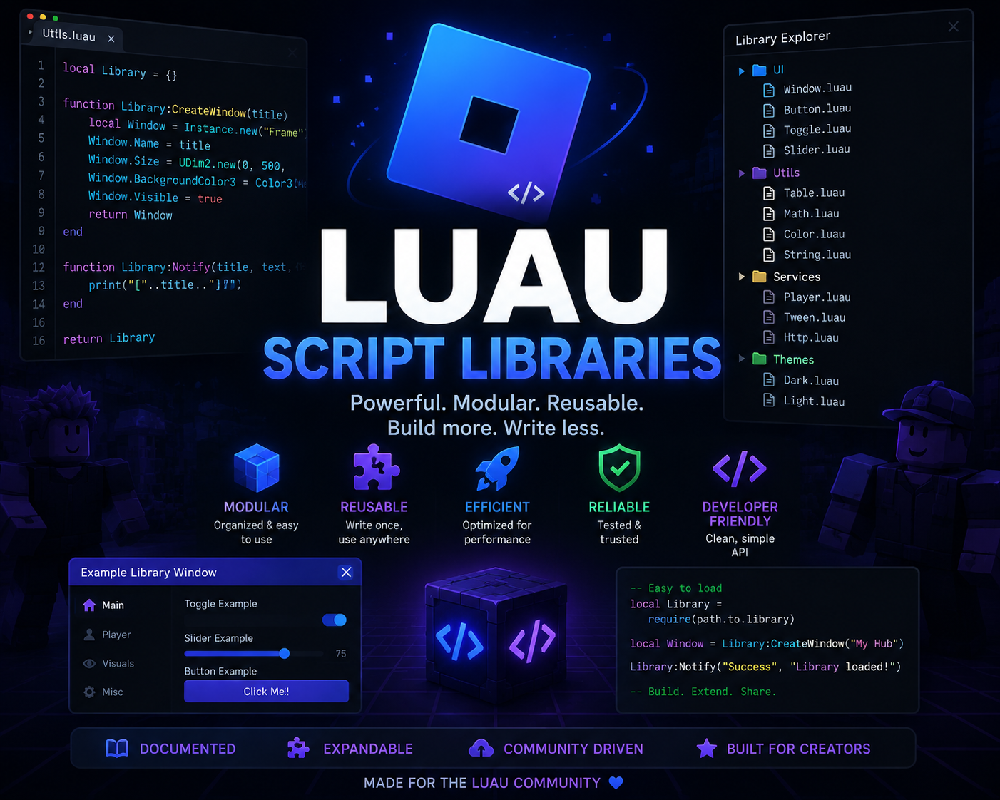

# LibHub



## **Spying Lib**

```luau
local SpyingLib = loadstring(game:HttpGet('https://raw.githubusercontent.com/Actusis-Nricul/LibHub/refs/heads/main/SpyingLib.luau'))()

local Tabs = SpyingLib:Window("My Hub")

local MainTab = Tabs:AddSection("Main", "home")

MainTab:Button("Click Me", "star", function() print("clicked") end)

MainTab:Toggle("Fly", false, "rocket", function(v) print(v) end)

MainTab:Slider("Speed", 16, 200, 16, "zap", function(v) print(v) end)

MainTab:TextBox("Name", 3, "edit", function(t) print(t) end)

MainTab:Dropdown("Mode", {"A", "B"}, "A", "settings", function(v) print(v) end)

MainTab:Keybind("Toggle UI", "K", "key", function() print("pressed") end)
```

## **Spider Lib**

```luau
local SpiderLib = loadstring(game:HttpGet('https://raw.githubusercontent.com/Actusis-Nricul/LibHub/refs/heads/main/SpiderLib.luau'))()

local Sections = SpiderLib:win("My Hub", "home")

local MainTab = Sections:tab("Main", "home")

MainTab:button("Click Me", "star", function() print("clicked") end)

MainTab:toggle("Fly", false, "rocket", function(v) print(v) end)

MainTab:slider("Speed", 16, 200, 16, "zap", function(v) print(v) end)

MainTab:textbox("Name", "", "edit", function(t) print(t) end)

MainTab:dropdown("Mode", {"A", "B"}, "A", "settings", function(v) print(v) end)

MainTab:keybind("Toggle UI", "K", "key", function() print("pressed") end)
```
